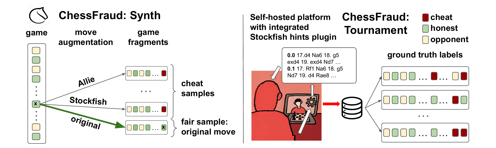

# ChessFraud & ChessFraud-Synth

<p align="center">
  <a href="https://doi.org/10.1145/3770855.3817587"></a>
  <a href="https://huggingface.co/datasets/artemlepin/chess-fraud"></a>
  <a href="LICENSE"></a>
</p>

**Datasets and benchmark code for the accepted KDD 2026 Datasets and Benchmarks Track paper _“ChessFraud: Exploring the Capabilities of Human-Aligned Models for Cheating Detection in Online Chess.”_**

ChessFraud is a public research benchmark for studying move-level and player-game-level cheating detection in online chess. The repository combines controlled-tournament data, large-scale synthetic data, dataset-construction pipelines, experiment code, notebooks, and derived results.

## 👋 Overview

- **ChessFraud** is a controlled-tournament dataset with ground-truth move-level and player-game-level cheating annotations collected under a protocol in which engine use was explicitly logged.
- **ChessFraud-Synth** is a synthetic dataset derived from real Lichess blitz games by replacing selected moves with suggestions from classical engines and human-aligned chess models.
- **Benchmark code** covers move-level and game-level cheating-detection experiments, including analyses based on classical engines and human-aligned model representations.

<p align="center">
  
</p>
<p align="center"><em>Figure 1. ChessFraud dataset collection: synthetic data (left) and controlled-tournament data (right).</em></p>

## 📄 Abstract

Human-aligned chess models, designed to mimic human decision-making rather than maximize engine strength, pose a novel challenge for online fair-play enforcement. While prior work assesses these models on move prediction accuracy, their potential as sophisticated cheating tools and their utility for cheating detection remain underexplored. We introduce ChessFraud, the first public benchmark for move-level cheating detection, providing 505 tournament games with ground-truth annotations from a controlled environment where engine usage was explicitly logged. To address the scarcity of real-world cheating data, we construct ChessFraud-Synth, a large-scale synthetic dataset derived from 12,000 Lichess games. For each game prefix, we generate a paired sample by replacing the final move with a suggestion from a classical engine or a human-aligned model, creating balanced fair/cheating instances that isolate positional context from move choice. Using these synthetic data, we train detectors based on frozen representations of human-aligned models, evaluating them on both synthetic and real tournament benchmarks. Our results demonstrate that while simple engine-agreement heuristics remain a strong baseline, human-aligned embeddings provide complementary signal, enabling the training of an applicable cheating detector. ChessFraud establishes a foundational benchmark for studying cheating detection in online chess as well as the dual role of human-AI alignment in chess.

## 📦 Datasets

Both datasets are available from the **[ChessFraud repository on Hugging Face](https://huggingface.co/datasets/artemlepin/chess-fraud)**.

### ChessFraud

ChessFraud is the controlled-tournament benchmark. Engine assistance was logged directly, enabling move-level and player-game-level evaluation.

| Statistic | Value |
|---|---:|
| Games | 505 |
| Unique players | 49 |
| Player-games | 1,010 |
| Half-moves | 38,510 |
| Cheating player-games | 407 (40.3%) |
| Cheating half-moves | 9,405 (24.4%) |

### ChessFraud-Synth

ChessFraud-Synth is the synthetic training dataset. It retains observed Lichess game sequences and provides assisted alternatives from classical engines and human-aligned chess models.

| Statistic | Value |
|---|---:|
| Player-games | 12,000 |
| Half-moves | 1,074,287 |
| Eligible focal-player decision points | 417,207 |

The dataset card provides complete schemas, split definitions, provenance, limitations, and source terms.

## 🚀 Quick Start: Setup Data

Install the Hugging Face `datasets` library and load either configuration directly:

```bash
python -m pip install datasets
```

```python
from datasets import load_dataset

chess_fraud = load_dataset(
    "artemlepin/chess-fraud", "chess_fraud", split="full"
)
chess_fraud_synth_train = load_dataset(
    "artemlepin/chess-fraud", "chess_fraud_synth", split="train"
)
```

## 🗂️ Repository Structure

The tree below summarizes the main components of the public repository.

```text
.
├── data/
│   ├── raw/example/            # Small source-data fixtures for the synthetic-data pipeline
│   ├── interim/example/        # Example intermediate tables and transformation outputs
│   └── maia2/                  # Maia-2 model configuration used by the project
├── data_generation/
│   └── synth/                  # Config-driven ChessFraud-Synth construction and enrichment pipeline
├── experiments/
│   ├── analisys/               # Tournament exploratory data analysis
│   ├── collection_cls_experiment/  # Collection- and game-level classification experiments
│   └── move_level/             # Move-level features, models, evaluation code, and notebooks
├── external_models/
│   └── allie                   # Pinned Allie model repository
├── reports/
│   └── move_level/             # Tracked figures, model artifacts, and analytical outputs
├── LICENSE
└── README.md
```

The synthetic-data pipeline has its own detailed guide in [`data_generation/synth/README.md`](data_generation/synth/README.md).

## ⚖️ Ethics and Responsible Use

- **Consent and privacy:** Tournament participants provided informed consent, and ChessFraud uses pseudonymous player identifiers. ChessFraud-Synth retains public Lichess usernames and game identifiers for source auditing and is therefore not anonymous. A synthetic assistance alternative does not imply that the corresponding player requested or used assistance. Raw tournament server logs remain private.
- **Misuse risk:** This work may inform adversarial cheating strategies. The tournament cheating plugin is not released.
- **Bias and coverage:** ChessFraud covers a small controlled cohort and a single time control. Models trained on this dataset may not generalize to other populations, formats, or platform-specific behaviors.

This repository provides research datasets and benchmark code. It is **not** an anti-cheat product and is **not** intended to be used for enforcement decisions without substantial additional validation.

## ✍️ Citation & License

If you find this work useful, please cite our paper:

```bibtex
@inproceedings{linich2026chess_fraud,
  title     = {ChessFraud: Exploring the Capabilities of Human-Aligned Models for Cheating Detection in Online Chess},
  author    = {Linich, Anastasiia and Lepin, Artem and Sakhovskiy, Andrey and Toleutaeva, Anita and Lepa, Georgii and Neznamov, Andrei and Budennyy, Semen},
  booktitle = {Proceedings of the 32nd ACM SIGKDD Conference on Knowledge Discovery and Data Mining},
  year      = {2026},
  doi       = {10.1145/3770855.3817587},
  note      = {Linich and Lepin contributed equally (joint first authors).}
}
```

Paper: <https://doi.org/10.1145/3770855.3817587>

Source code in this repository is released under the **GNU General Public License v3.0**. See [LICENSE](LICENSE). Dataset licensing and source terms are documented separately in the [Hugging Face dataset card](https://huggingface.co/datasets/artemlepin/chess-fraud).

## 🍻 Acknowledgements

We thank the development team responsible for building and maintaining the chess platform and the integrated cheating plugin.

## 📬 Contact

- Artem Lepin: `artemlepin.ml@gmail.com`
- Anastasiia Linich: `asya.more.collab@gmail.com`
